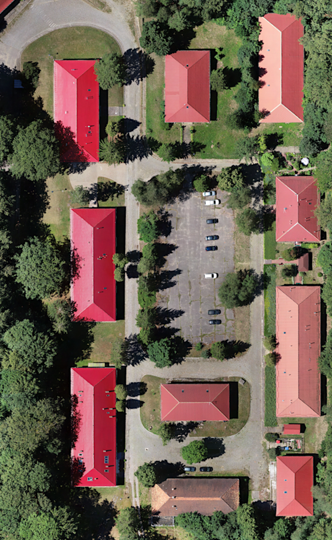
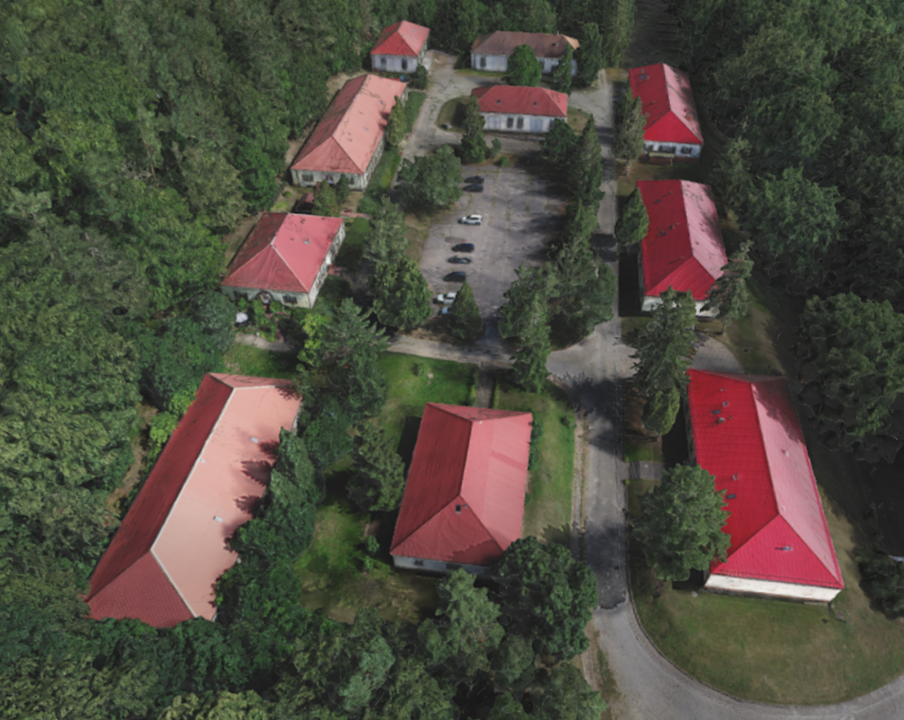

# Ortofotomapa oraz model 3D Stacji Monitoringu Środowiska Przyrodniczego UAM w Białej Górze

 
https://adrian-nowacki.github.io/model-3D-Baza-Wolin/
 

 

Ortofotomapa została publicznie udostępniona jako WMS w strefie 5 układu współrzędnych 2000 (EPSG:2176), pod adresem: https://poznan-gis.pl/geoserver/Wolin/wms?version=1.1.0.

 

 

* **Ortofotomapa**

 

* **Model 3D**

